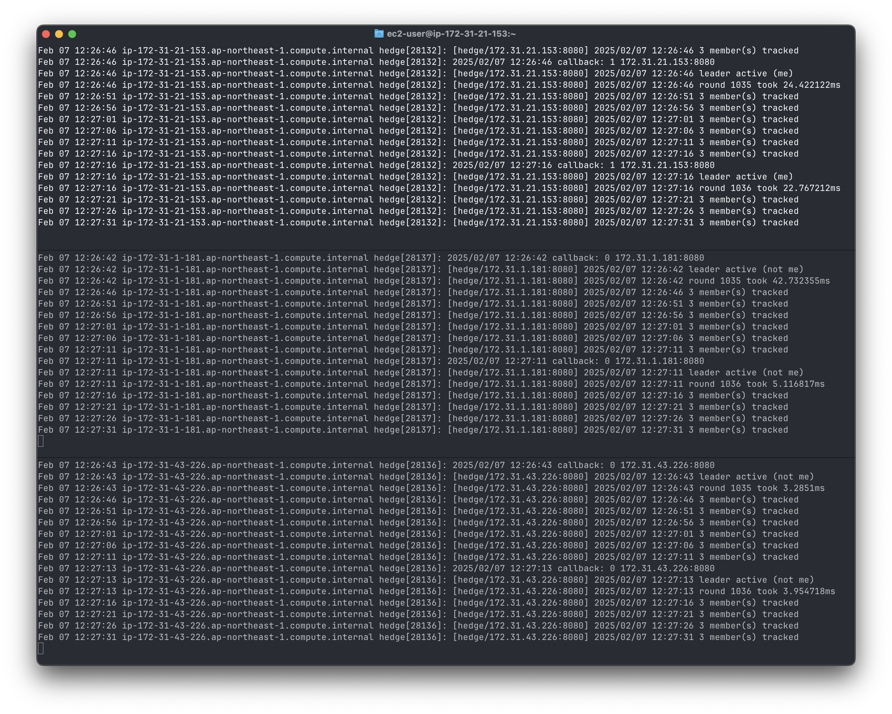

[](https://github.com/flowerinthenight/hedge-cb/actions/workflows/main.yml)
[](https://pkg.go.dev/github.com/flowerinthenight/hedge-cb)

## hedge-cb

An AWS-native, cluster membership [Go](https://go.dev/) library. It is built on [spindle-cb](https://github.com/flowerinthenight/spindle-cb), a distributed locking library built on [aws/clock-bound](https://github.com/aws/clock-bound) and PostgreSQL. It is a port (subset only) of [hedge](https://github.com/flowerinthenight/hedge). Ported features include:

* Tracking of member nodes - good for clusters with sizes that can change dynamically overtime, such as [AWS Autoscaling Groups](https://docs.aws.amazon.com/autoscaling/ec2/userguide/auto-scaling-groups.html), and [Kubernetes Deployments](https://kubernetes.io/docs/concepts/workloads/controllers/deployment/);
* Leader election - the cluster elects and maintains a single leader node at all times;
* List of members - get a list of all member nodes at any time;
* [Streaming] Send - any member node can send messages to the leader at any time;
* [Streaming] Broadcast - any member node can broadcast messages to all nodes at any time.

## Requirements

* A PostgreSQL database - a requirement of [spindle-cb](https://github.com/flowerinthenight/spindle-cb).
* The [ClockBound daemon](https://github.com/aws/clock-bound/tree/main/clock-bound-d) - a requirement of [spindle-cb](https://github.com/flowerinthenight/spindle-cb).
* All nodes within a cluster should be able to contact each other via TCP (host:port).
* Each hedge-cb's instance id should be set using the node's host:port. The host part can be inferred internally as well.

## Running the sample

A sample cloud-init [startup script](./startup-aws-asg.sh) is provided for spinning up an [Auto Scaling Group](https://docs.aws.amazon.com/autoscaling/ec2/userguide/auto-scaling-groups.html) with the ClockBound daemon already setup and running. You need to update the `ExecStart` section first with a working PostgreSQL connection value. Note that this is NOT recommended though. You should use something like IAM Role + Secrets Manager, for instance.

```sh
# Create a launch template. ImageId here is Amazon Linux, default VPC.
# (Added newlines for readability. Might not run when copied as is.)
$ aws ec2 create-launch-template \
  --launch-template-name hedge-lt \
  --version-description version1 \
  --launch-template-data '
  {
    "UserData":"'"$(cat startup-aws-asg.sh | base64 -w 0)"'",
    "ImageId":"ami-0fb04413c9de69305",
    "InstanceType":"t2.micro",
  }'

# Create the single-zone ASG; update {target-zone} with actual value:
$ aws autoscaling create-auto-scaling-group \
  --auto-scaling-group-name hedge-asg \
  --launch-template LaunchTemplateName=spindle-lt,Version='1' \
  --min-size 3 \
  --max-size 3 \
  --tags Key=Name,Value=hedge-asg \
  --availability-zones {target-zone}

# or a multi-zone ASG; update {subnet(?)} with actual value(s):
$ aws autoscaling create-auto-scaling-group \
  --auto-scaling-group-name hedge-asg \
  --launch-template LaunchTemplateName=spindle-lt,Version='1' \
  --min-size 3 \
  --max-size 3 \
  --tags Key=Name,Value=hedge-asg \
  --vpc-zone-identifier "{subnet1,subnet2,subnet3}"

# You can now SSH to the instance(s). Note that it might take some time
# before ClockBound is running due to the need to build it in Rust. You
# can wait for the `clockbound` process, or tail the startup script output,
# like so:
$ tail -f /var/log/cloud-init-output.log

# Tail the service logs:
$ journalctl -f -u hedge

# Test the Send API (send message to current leader):
$ curl -v localhost:9090/send -d "hello-leader"

# Test the Broadcast API (send message to all nodes):
$ curl -v localhost:9090/broadcast -d "hello-all"
```

<p align="left">
  
</p>

## License

This library is licensed under the [Apache 2.0 License](./LICENSE).
